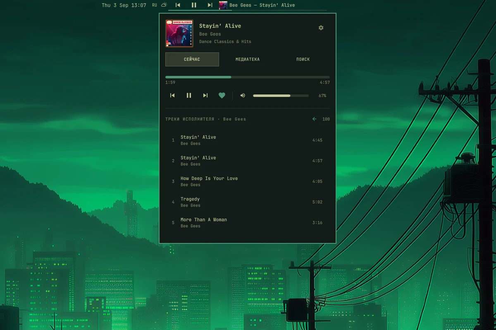
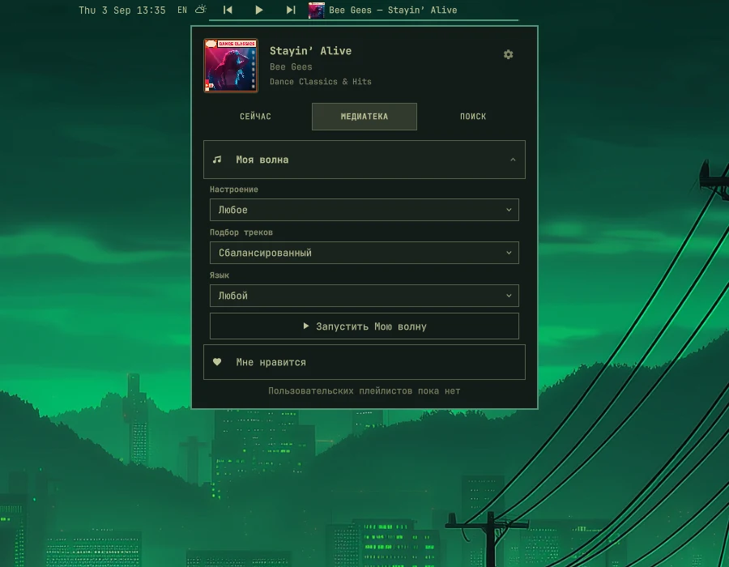
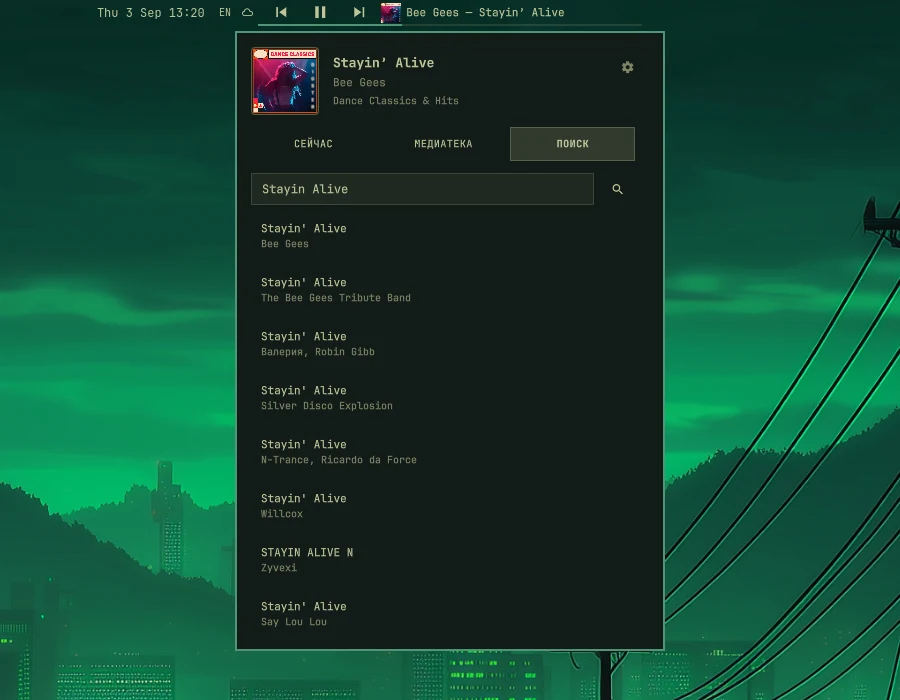
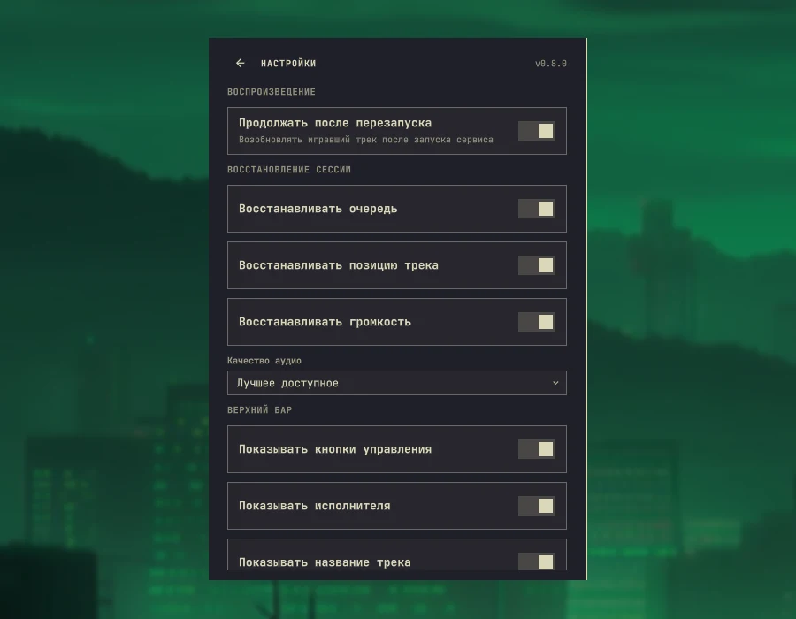
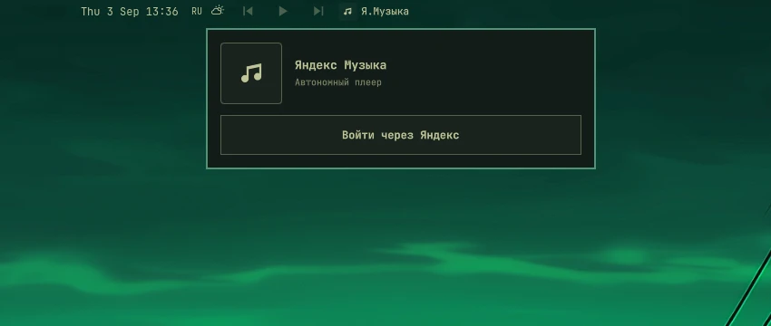

# Yandex Music for Omarchy

[Русская версия](README.ru.md)

A native Yandex Music mini-player for the [Omarchy](https://omarchy.org/) shell. The browser is used only for Yandex Device OAuth; playback runs in the background through `mpv`.

> This project uses the unofficial [yandex-music-api](https://github.com/MarshalX/yandex-music-api) library and is not affiliated with Yandex. A Yandex Music subscription may be required for full-track playback.

## Screenshots

<p align="center">
  
</p>

<p align="center">
  <a href="docs/screenshots/library.webp"></a>
  <a href="docs/screenshots/search.webp"></a>
</p>
<p align="center"><em>Library and search</em></p>

<p align="center">
  <a href="docs/screenshots/settings.webp"></a>
</p>
<p align="center"><em>Built-in settings</em></p>

<p align="center">
  <a href="docs/screenshots/signed-out.webp"></a>
</p>
<p align="center"><em>Sign in through Yandex Device OAuth</em></p>

## Highlights

- Native mini-player in the Omarchy bar
- Background playback without an open browser
- Now Playing, Library, Search, queue, and artist browsing
- “My Wave” with mood, discovery, and language controls
- Likes, personal playlists, and individual clickable artists
- Ordered, shuffle, repeat queue, and repeat track modes
- System media keys and privacy-safe MPRIS integration
- Persistent queue, position, volume, pause state, and preferences
- Configurable bar layout, artwork shape, marquee text, and notifications
- Retry/recovery for interrupted streams and expiring OAuth tokens

## Screens and controls

### Bar

The bar player can show previous, play/pause, and next controls, album artwork, artist, track title, and progress. Click the artwork or track information to open the popup.

Long artist/title text can be truncated or scrolled as one continuous line. The information width, controls, artwork, and progress line are configurable.

### Now Playing

- Drag the seek slider; the real position remains visible and the target time is shown in parentheses
- Drag the volume slider or click the speaker to mute
- Like or unlike the current track with the heart button or `L`
- Change playback mode with the button beside the queue counter
- Select any queue item directly
- Click an individual artist to browse their tracks

Opening an artist, “My Likes”, or a personal playlist does **not** interrupt the current track. A separate list is loaded and playback starts only after you select a track. Large library collections load in batches of 50 tracks, with the next page fetched automatically when you reach the end of the list. Recently opened collections and all pages already fetched for them are restored instantly from a short-lived in-memory cache.

### Library

- Browse “My Likes” without autoplay
- Browse personal playlists without autoplay
- Expand “My Wave” and configure:
  - mood: any, fun, active, calm, or sad
  - selection: balanced, favorites, popular, or discovery
  - language: any, Russian, or non-Russian

### Search

Search for tracks and start playback from any result. Loading lists use stable skeleton placeholders so the popup does not resize unexpectedly. Hover the corner loader to see the current operation, elapsed wait time, Yandex Music API latency, and regional availability.

### Settings

Open settings with the gear in the top-right corner of the popup.

Available options:

- Resume playback after service restart
- Restore queue, track position, and volume independently
- Best available or traffic-saving audio quality
- Show/hide bar controls, artist, title, artwork, and progress
- Square, rounded, or circular artwork
- Compact, normal, or wide track information
- Truncated or smoothly scrolling long text
- Track-change notifications with album artwork
- Sign out with confirmation

Preferences are stored in `~/.config/omarchy-yandex-music/preferences.json` with mode `600`.

## System media controls

The backend exposes a sanitized MPRIS player named **Yandex Music**. Omarchy and keyboard media keys can control play/pause, previous, and next. MPRIS includes track metadata and artwork but never publishes temporary audio stream URLs.

## Requirements

- Omarchy 4.x
- Python 3
- `mpv`
- `git`
- `jq`
- Network access

## Installation

Install and enable the plugin with the standard Omarchy command:

```bash
omarchy plugin add https://github.com/vornashev/omarchy-yandex-music.git --enable
```

No manual `git clone`, `cd`, or `sudo` is required. On its first load, the plugin automatically installs its Python environment, CLI, and systemd user service. This initial setup may take a moment. It creates:

- `~/.config/omarchy/plugins/vornashev.yandex-music/`
- `~/.local/share/omarchy-yandex-music/`
- `~/.local/bin/omarchy-yandex-music`
- `~/.config/systemd/user/omarchy-yandex-music.service`

After installation, click the player in the bar, start Yandex Device OAuth, and use the button beside the displayed code to copy it before opening the authorization page. The browser can be closed after sign-in.

## Keyboard shortcuts

Inside the popup:

- `1`, `2`, `3` — Now Playing, Library, Search
- `Space` — play/pause
- `L` — like/unlike
- `C` — copy the Device OAuth code while signing in
- `Escape` — return from settings or close the popup

Hardware media keys are handled through MPRIS.

## Updating

```bash
omarchy plugin update vornashev.yandex-music
```

The backend is updated automatically when the refreshed plugin loads.

## Uninstalling

Use the plugin's uninstaller so its background service and CLI are removed too.

Keep the OAuth token, preferences, and playback state:

```bash
~/.config/omarchy/plugins/vornashev.yandex-music/uninstall.sh
```

Remove all local data as well:

```bash
~/.config/omarchy/plugins/vornashev.yandex-music/uninstall.sh --purge
```

## Troubleshooting

```bash
systemctl --user status omarchy-yandex-music.service
journalctl --user -u omarchy-yandex-music.service -n 100
omarchy-yandex-music status | jq
omarchy restart shell
```

## Privacy and storage

- OAuth token: `~/.config/omarchy-yandex-music/token.json`
- Playback state: `~/.config/omarchy-yandex-music/state.json`
- Preferences: `~/.config/omarchy-yandex-music/preferences.json`
- Temporary notification artwork: `$XDG_RUNTIME_DIR/omarchy-yandex-music-covers/`

Credential and state files use mode `600` and are excluded from the repository. Notification artwork is temporary and disappears after reboot.

## License

[MIT](LICENSE)
