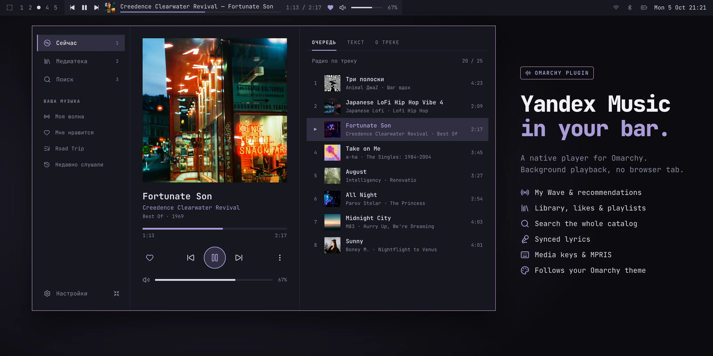
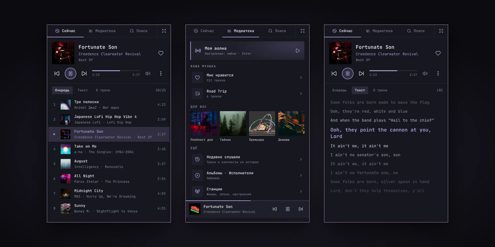
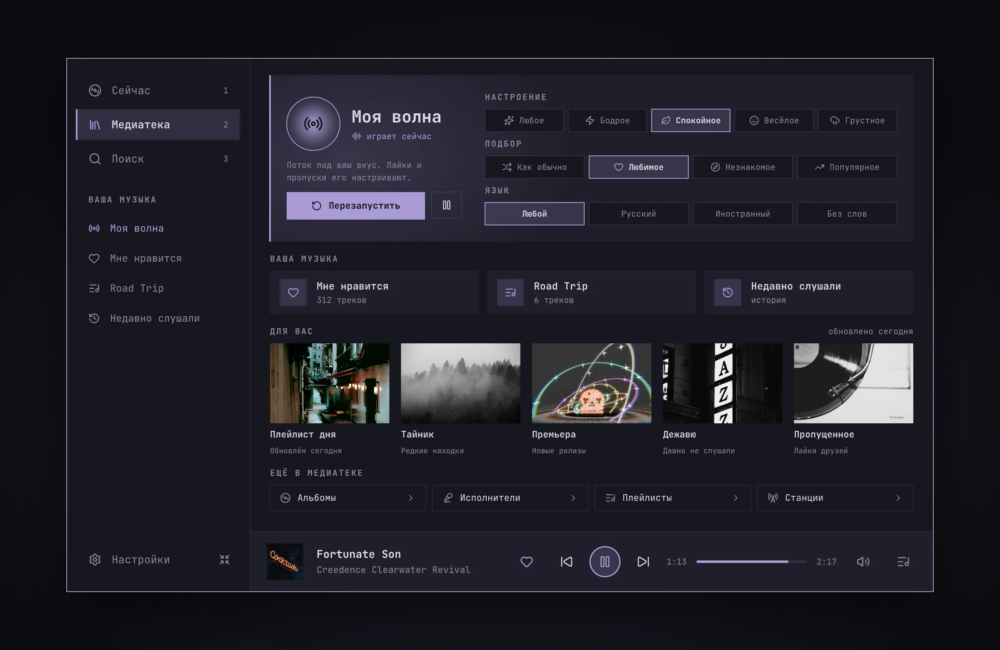
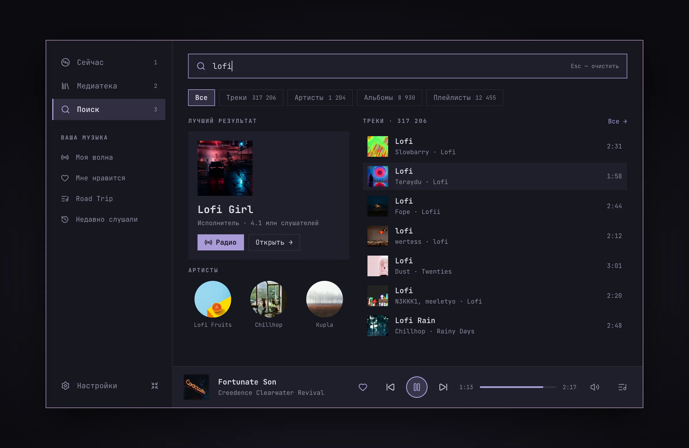
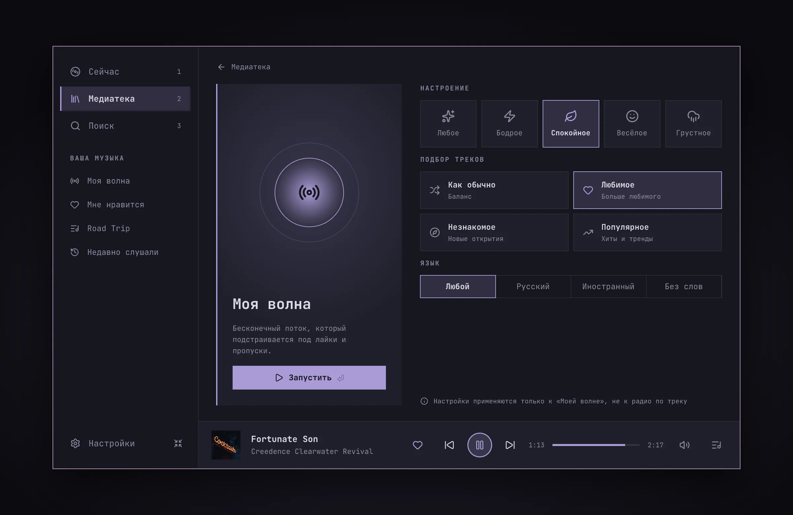
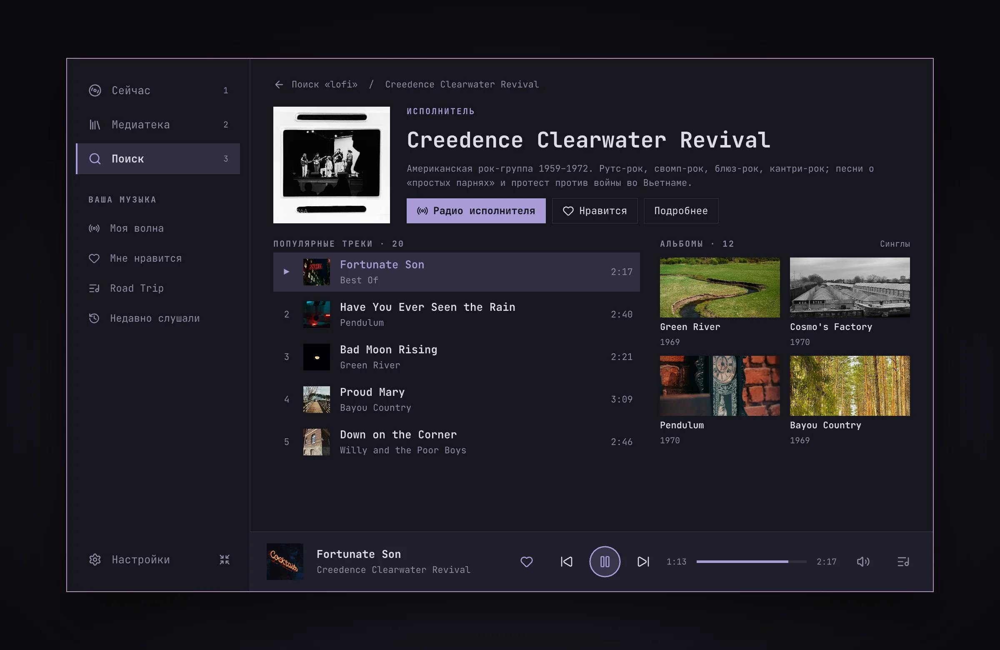
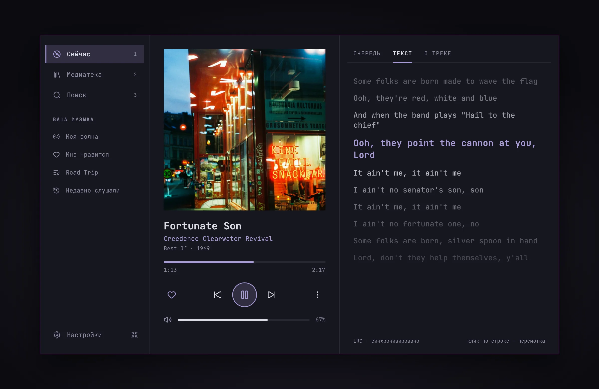
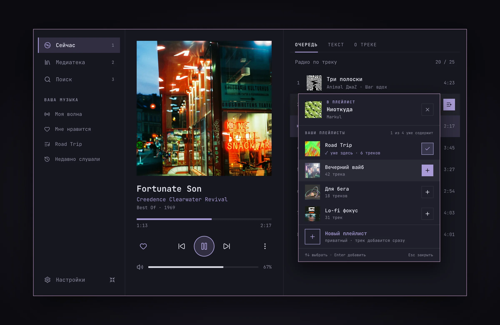
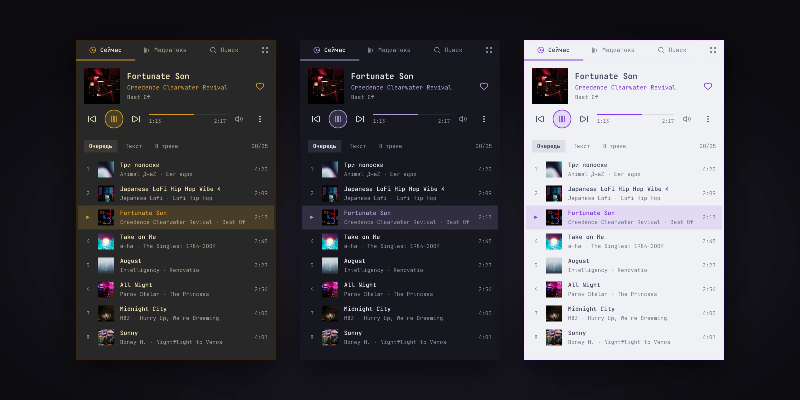
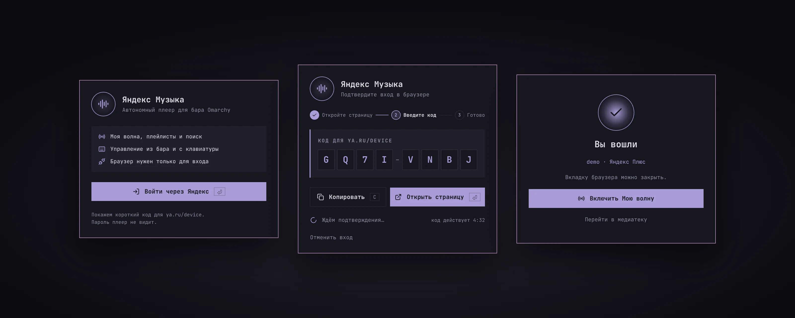

# Yandex Music for Omarchy

[Русский](README.ru.md) · [Changelog](CHANGELOG.md) · [Report an issue](https://github.com/vornashev/omarchy-yandex-music/issues)

A native Yandex Music player in your [Omarchy](https://omarchy.org/) bar. Music plays in the background through `mpv`; the browser is only needed to sign in.

## Installation

For **Omarchy 4.x**. A Yandex Music subscription may be required for full tracks.

```bash
omarchy plugin add https://github.com/vornashev/omarchy-yandex-music.git --enable
```

The first launch sets up the Python environment and background service automatically. No manual clone or `sudo`; allow a moment for setup.

1. Click the player in the bar and choose **Sign in with Yandex**.
2. Copy the code, open the authorization page, and enter it in your browser.
3. Start **My Wave** or choose a track in **Library**. You can close the browser.

<details>
<summary>System requirements</summary>

Internet access, Python 3 (`python`), `mpv`, `jq`, `util-linux` (`flock`) and `coreutils` (`sha256sum`).

</details>

## Interface

<p align="center">
  <a href="preview.webp"></a>
</p>

<p align="center"><em>Wide view · Design previews with demo data, not captures of the running app. Some details may differ.</em></p>

## Features

- **My Wave & radio** — music to match your mood, with likes and recommendation controls.
- **Library & search** — your favorites and the full catalog, without interrupting playback.
- **Playlists** — add tracks, create private playlists and explore recommendations.
- **Lyrics & track info** — synced lyrics with click-to-seek and recording credits.
- **Playback** — shuffle, repeat, media keys and resume where you left off.
- **Your layout** — Compact or Wide, Omarchy theme colors and a customizable bar.

## Gallery

Compact keeps the player, library and lyrics in a smaller popup. Press `W` to switch between Compact and Wide.

<p align="center">
  <a href="docs/screenshots/compact.webp"></a>
</p>
<p align="center"><em>Compact view</em></p>

Click any preview to view it full-size.

<p align="center">
  <a href="docs/screenshots/library.webp"></a>
  <a href="docs/screenshots/search.webp"></a>
</p>
<p align="center"><em>Library · Search</em></p>

<details>
<summary>View more screens</summary>

<p align="center">
  <a href="docs/screenshots/my-wave.webp"></a>
  <a href="docs/screenshots/artist.webp"></a>
</p>
<p align="center"><em>My Wave · Artist</em></p>

<p align="center">
  <a href="docs/screenshots/lyrics.webp"></a>
  <a href="docs/screenshots/add-to-playlist.webp"></a>
</p>
<p align="center"><em>Lyrics · Add to playlist</em></p>

<p align="center">
  <a href="docs/screenshots/themes.webp"></a>
  <a href="docs/screenshots/sign-in.webp"></a>
</p>
<p align="center"><em>Themes · Sign-in</em></p>

</details>

## Controls

- **Open the player:** click the artwork or track title in the bar. Right-click the title to play/pause.
- **Volume:** scroll over the track information or volume control; click the speaker to mute.
- **Settings:** open **Actions (⋯)** or use the Wide sidebar.

| Key | Action |
| --- | --- |
| `Space` | Play / pause |
| `N` / `P` | Next / previous track |
| `L` / `D` | Like / “Do not recommend” |
| `1` / `2` / `3` | Now Playing / Library / Search; repeat to return to the tab's root |
| `W` | Switch Compact / Wide |
| `Alt+Left` / `Backspace` | Back, except while editing a nonempty text field |
| `Esc` | Close a dialog or settings, go back, then close the popup at a tab root |
| `C` | Copy the sign-in code |

Player shortcuts work while the popup is open, outside text fields and settings. Letter shortcuts also work with the Russian keyboard layout; hardware media keys work through MPRIS.

## Reference

<details>
<summary>Update</summary>

```bash
omarchy plugin update vornashev.yandex-music
```

The player updates automatically when the plugin loads; your sign-in and preferences are preserved.

</details>

<details>
<summary>Troubleshooting</summary>

Check the background service and its log:

```bash
systemctl --user status omarchy-yandex-music.service
journalctl --user -u omarchy-yandex-music.service -n 100
omarchy-yandex-music status | jq '{version, authenticated, loading, error}'
```

If the widget does not appear, try `omarchy restart shell`. When reporting an issue, include the version and error; redact private data from logs and never share `token.json`.

</details>

<details>
<summary>Uninstall & local data</summary>

Remove the plugin, background service, CLI and audio cache while keeping your sign-in, preferences and playback state:

```bash
~/.config/omarchy/plugins/vornashev.yandex-music/uninstall.sh
```

To also remove your sign-in, preferences and playback state, add `--purge` when running the command above.

- Token, playback state and preferences: `~/.config/omarchy-yandex-music/` (files use mode `600`).
- Collections are cached only in memory. The audio cache in `$XDG_CACHE_HOME/omarchy-yandex-music/audio` (default `~/.cache/omarchy-yandex-music/audio`) is capped at **256 MiB**; it is not an offline library.
- MPRIS exposes track metadata and artwork, never temporary audio URLs.

</details>

<details>
<summary>Development</summary>

Run from the repository root; real-audio tests also require `ffmpeg`:

```bash
python -m compileall -q backend tests
(
  test_home="$(mktemp -d)"
  trap 'rm -rf -- "$test_home"' EXIT
  HOME="$test_home" dbus-run-session -- \
    ~/.local/share/omarchy-yandex-music/venv/bin/python -m unittest discover -s tests
)
QT_QPA_PLATFORM=offscreen /usr/lib/qt6/bin/qmltestrunner -input tests/qml -import .
for smoke in tests/smoke/*/run.sh; do bash "$smoke"; done
for script in bootstrap.sh install.sh uninstall.sh; do bash -n "$script"; done
omarchy plugin validate .
```

The temporary home and session D-Bus isolate tests from your account and desktop player. To deploy local changes, run `./install.sh --backend-only`, then `omarchy restart shell`. See [audio cache validation](docs/audio-cache-validation.md).

</details>

---

[MIT](LICENSE) · Unofficial project using [yandex-music-api](https://github.com/MarshalX/yandex-music-api); not affiliated with Yandex.
