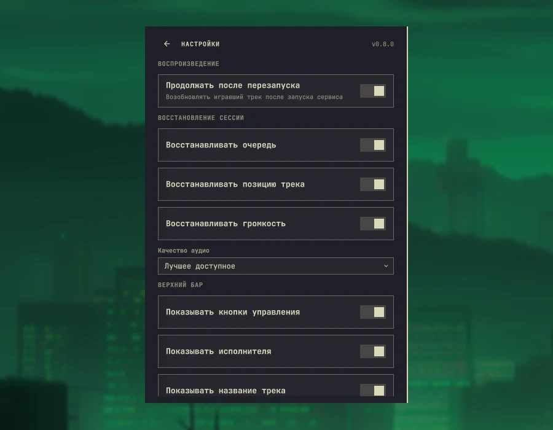
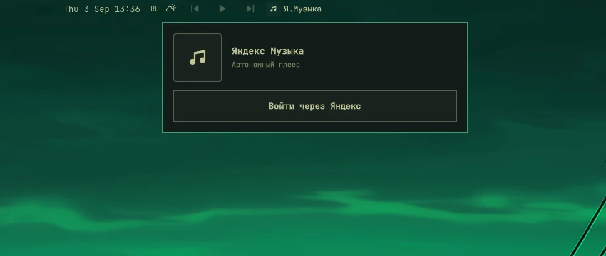

# Yandex Music for Omarchy

[Русская версия](README.ru.md)

A native Yandex Music mini-player for the [Omarchy](https://omarchy.org/) shell. The browser is used only for Yandex Device OAuth; playback runs in the background through `mpv`.

> This project uses the unofficial [yandex-music-api](https://github.com/MarshalX/yandex-music-api) library and is not affiliated with Yandex. A Yandex Music subscription may be required for full-track playback.

## Screenshots

<p align="center">
  
</p>

<p align="center">
  <a href="docs/screenshots/library.webp"></a>
  <a href="docs/screenshots/search.webp"></a>
</p>
<p align="center"><em>Library and search</em></p>

<p align="center">
  <a href="docs/screenshots/settings.webp"></a>
</p>
<p align="center"><em>Built-in settings</em></p>

<p align="center">
  <a href="docs/screenshots/signed-out.webp"></a>
</p>
<p align="center"><em>Sign in through Yandex Device OAuth</em></p>

## Highlights

- Native mini-player in the Omarchy bar
- Background playback without an open browser
- Now Playing, Library, and a unified Search catalog for tracks, artists, albums, and playlists
- “My Wave” with mood, discovery, language controls, and recommendation feedback
- Likes, “Do not recommend”, user and generated playlists, listening history, favorite entities, and radio stations
- Add tracks to playlists, create private playlists, remove tracks from owned playlists, and browse recommendations for extending them
- Synced lyrics with active-line highlighting, auto-scroll, and click-to-seek
- Track radio with a sequence of similar recommendations and radio feedback
- On-demand release details and recording credits
- Ordered, shuffle, repeat queue, and repeat track modes
- Bounded audio cache and background preparation of the next selected track
- System media keys and privacy-safe MPRIS integration
- Persistent queue, position, volume, pause state, and preferences
- Configurable bar layout, artwork shape, marquee text, and notifications
- Retry/recovery for interrupted streams and expiring OAuth tokens

## Screens and controls

### Bar

The bar player can show previous, play/pause, and next controls, album artwork, artist, track title, progress, and a volume control to the right of the title. Scroll the mouse wheel over the volume area to adjust the level in 5% steps, click the speaker icon to mute, and click the artwork or track information to open the popup.

Long artist/title text can be truncated or scrolled as one continuous line. The information width, controls, artwork, progress line, and bar volume control are configurable. Settings → Bar → Show volume hides the bar volume area independently of the popup slider; it is enabled by default.

### Now Playing

- Drag the seek slider and release to apply it; the real position remains visible while the target time is shown in parentheses
- Previous, Play/Pause, and Next form a larger centered transport group, with Play/Pause emphasized and Like/Actions symmetrically framing it at the outer edges
- Mute, the volume slider, and its percentage sit directly under the transport controls in both the regular and expanded cover views; the volume follows a perceptual curve so quiet settings stay audible, while the Actions sheet keeps infrequent commands out of the way
- Like or unlike with the heart button or `L`; use Actions or `D` to toggle “Do not recommend”, which immediately skips a new dislike in “My Wave”
- Actions also provides Add current track to playlist, Track Radio, queue mode, and Settings
- Click the cover to smoothly expand it across the popup while retaining track details, a seekable progress bar, and the same control hierarchy; the mode survives closing and reopening the popup, while another click or `Escape` returns to the regular view
- Explicit List, Lyrics, and Track Info tabs replace the former cluster of ambiguous queue-header icons
- The list, lyrics, and track-info areas fit the remaining popup height and scroll internally, keeping the player controls stationary; exceptionally short screens retain outer scrolling so controls stay reachable
- In Lyrics, synced LRC lines highlight and scroll with playback and clicking a line seeks to it; plain lyrics are used as a fallback, while missing lyrics or loading errors never interrupt playback
- Track Info shows available album, release date, genre, labels, track number, version, description, and recording credits
- Select any queue item directly
- Hover a track row to reveal its playlist action; in the queue it replaces the duration, opens an owned-playlist picker or creates a new private playlist without activating the row, and playlists that already contain the track are marked and cannot receive a duplicate
- Click an artist or album link to open its page in the Search catalog

Opening “My Likes” or a personal library playlist does **not** interrupt the current track. A separate list is loaded and playback starts only after you select a track. Large library collections load in batches of 50 tracks, with the next page fetched automatically when you reach the end of the list. Recently opened collections and all pages already fetched for them are restored instantly from a short-lived in-memory cache. Lyrics and detailed track information load only on demand and remain in memory for the current and a few recently opened tracks.

### Audio caching

During playback, one background downloader prepares the next selected track, then caches the current track when it was opened from the network. This can download the current track a second time; preparing the next track takes priority. Completed files play locally, including when the network goes away after preparation. Automatic transitions use mpv's playlist and file events instead of waiting for the one-second position poll. Shuffle reuses the candidate chosen for preparation; manual Next still advances in repeat-track mode.

The audio cache is limited to **256 MiB**, including temporary downloads, with a **64 MiB** limit per file. Least recently used files are evicted while the current and next tracks are protected. Partial or damaged files are discarded, and cache/network failures fall back to ordinary streaming. This is a playback cache, not an offline library. Tracks that have not finished downloading and radio boundaries requiring another batch may still have a network delay. Preloading does not send listening feedback or show a loading indicator.

Files are separated by account, quality, codec, and bitrate in `$XDG_CACHE_HOME/omarchy-yandex-music/audio`, or `~/.cache/omarchy-yandex-music/audio` when `XDG_CACHE_HOME` is unset or relative. The installer captures this path in the service environment and grants write access only to the audio subdirectory alongside the existing configuration/runtime allowances. Rerun `./install.sh --backend-only` after changing `XDG_CACHE_HOME`. Sign-out removes that account's audio; uninstall removes the audio cache even without `--purge`. To clear it manually, stop the service, remove this directory, recreate it with mode `700`, and start the service again.

### Library

- Browse “My Likes” and owned playlists without autoplay
- Remove a selected track from an owned playlist after confirmation, or open playlist recommendations and add one explicitly
- Lazily loaded generated mixes: Playlist of the Day, Missed Likes, Premiere, and Deja Vu
- A Recently Played section whose tracks and listening contexts load in pages of 50 items
- Favorite albums, artists, and saved third-party playlists linked to the existing catalog pages
- A searchable catalog of genre, activity, mood, and other stations with automatic scroll pagination; a queue starts only after an explicit station selection
- Sections and fetched data use bounded memory-only caches cleared on sign-out or backend restart
- Expand “My Wave” and configure:
  - mood: any, fun, active, calm, or sad
  - selection: balanced, favorites, popular, or discovery
  - language: any, Russian, or non-Russian

### Search

Search across tracks, artists, albums, and playlists, or use the sectioned **All** view. Suggestions appear after 300 ms once at least two characters are entered; a spinner inside the field remains visible while they are loading. Use ↑/↓ to highlight one and Enter or a mouse click to search for it. Results load page by page with an explicit load-more action.

Artist, album, and playlist pages open inside the same Search tab without changing playback. Every track row has a separate add-to-playlist action that does not start playback. Back returns to the unchanged query, filter, loaded pages, and result models. Album pages show metadata and tracks; artist pages place popular tracks first, followed by independently paginated Albums and Singles, then up to ten similar artists; playlist pages expose their tracks. Playback starts only when a track row is selected explicitly. When playback starts from an artist’s popular tracks, the queue fetches subsequent 20-track pages in the background and continues past the initially visible list. Catalog lists use their own virtualized scrolling below the fixed tabs and controls. Artwork automatically retries transient CDN failures and shows a fallback glyph if the image remains unavailable.

### Settings

Open Settings from the labeled Actions menu; the Settings page has its own Back control in the top-left corner.

Available options:

- Resume playback after service restart
- Restore queue, track position, and volume independently
- Best available or traffic-saving audio quality
- Show/hide bar controls, volume, artist, title, artwork, and progress independently
- Square, rounded, or circular artwork
- Compact, normal, or wide track information
- Truncated or smoothly scrolling long text
- Track-change notifications with album artwork
- Sign out with confirmation

Preferences are stored in `~/.config/omarchy-yandex-music/preferences.json` with mode `600`.

## System media controls

The backend exposes a sanitized MPRIS player named **Yandex Music**. Omarchy and keyboard media keys can control play/pause, previous, and next. MPRIS includes track metadata and artwork but never publishes temporary audio stream URLs.

## Requirements

- Omarchy 4.x
- Python 3
- `mpv`
- `jq`
- `util-linux` (`flock`)
- `coreutils` (`sha256sum`)
- Network access

## Installation

Install and enable the plugin with the standard Omarchy command:

```bash
omarchy plugin add https://github.com/vornashev/omarchy-yandex-music.git --enable
```

No manual `git clone`, `cd`, or `sudo` is required. On its first load, the plugin automatically installs its Python environment, CLI, and systemd user service. Python packages are installed only from the complete version- and SHA-256-locked wheel set in `requirements.txt`; the installer neither upgrades `pip` nor executes a live VCS dependency. This initial setup may take a moment. It creates:

- `~/.config/omarchy/plugins/vornashev.yandex-music/`
- `~/.local/share/omarchy-yandex-music/`
- `~/.local/bin/omarchy-yandex-music`
- `~/.config/systemd/user/omarchy-yandex-music.service`

After installation, click the player in the bar, start Yandex Device OAuth, and use the button beside the displayed code to copy it before opening the authorization page. The browser can be closed after sign-in.

## Keyboard shortcuts

Inside the popup:

Letter shortcuts follow physical QWERTY key positions, so they work with both English and Russian layouts. They are active only while the popup is open and are not intercepted in the search field or settings. The UI keeps the Latin mnemonic labels. There is no separate Stop shortcut: `Space` pauses playback without losing the position.

- `1`, `2`, `3` — Now Playing, Library, Search
- `Space` — play/pause
- `N` — next track
- `P` — previous track
- `L` — like/unlike
- `D` — toggle “Do not recommend”
- `F` — expand or collapse cover mode
- `C` — copy the Device OAuth code while signing in
- `Escape` — close Actions, collapse cover mode, return from Settings, or close the popup

Hardware media keys are handled through MPRIS.

## Updating

```bash
omarchy plugin update vornashev.yandex-music
```

The backend is updated automatically when the refreshed plugin loads. Regular updates and service restarts preserve the OAuth token; only explicit sign-out or uninstalling with `--purge` removes it.

## Uninstalling

Use the plugin's uninstaller so its background service and CLI are removed too.

Keep the OAuth token, preferences, and playback state:

```bash
~/.config/omarchy/plugins/vornashev.yandex-music/uninstall.sh
```

Remove all local data as well:

```bash
~/.config/omarchy/plugins/vornashev.yandex-music/uninstall.sh --purge
```

## Troubleshooting

```bash
systemctl --user status omarchy-yandex-music.service
journalctl --user -u omarchy-yandex-music.service -n 100
omarchy-yandex-music status | jq
omarchy restart shell
```

## Privacy and storage

- OAuth token: `~/.config/omarchy-yandex-music/token.json`
- Playback state: `~/.config/omarchy-yandex-music/state.json`
- Preferences: `~/.config/omarchy-yandex-music/preferences.json`
- Temporary notification artwork: `$XDG_RUNTIME_DIR/omarchy-yandex-music-covers/`

Credential and state files use mode `600` and are excluded from the repository. Notification artwork is temporary and disappears after reboot.

## Development

`omarchy plugin add` clones the repository straight into `~/.config/omarchy/plugins/vornashev.yandex-music`, so that checkout is both the installed plugin and a working copy. Run the checks from the repository root:

```bash
python -m compileall -q backend tests
HOME="$(mktemp -d)" ~/.local/share/omarchy-yandex-music/venv/bin/python -m unittest discover -s tests
QT_QPA_PLATFORM=offscreen /usr/lib/qt6/bin/qmltestrunner -input tests/qml -import .
for smoke in tests/smoke/*/run.sh; do bash "$smoke"; done
bash -n bootstrap.sh install.sh uninstall.sh bin/omarchy-yandex-music
omarchy plugin validate .
```

The temporary `HOME` keeps the suite away from your real token and playback state. The real-mpv audio tests additionally need `mpv` and `ffmpeg`; see [audio cache validation](docs/audio-cache-validation.md). After changing the backend, run `./install.sh --backend-only` (it reinstalls the service whenever backend files change) and `omarchy restart shell` to reload QML.

## License

[MIT](LICENSE)
