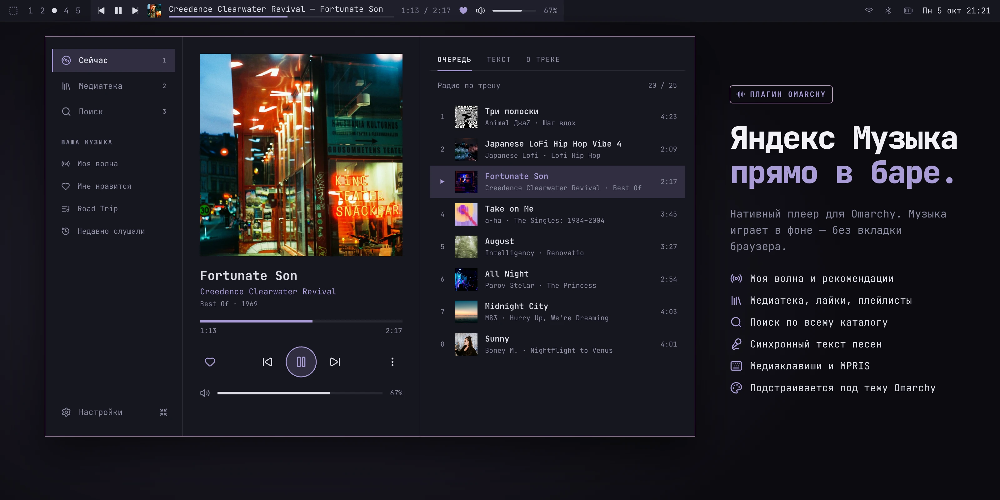

# Яндекс Музыка для Omarchy

[English](README.md) · [История изменений](CHANGELOG.ru.md) · [Сообщить о проблеме](https://github.com/vornashev/omarchy-yandex-music/issues)

Нативный плеер Яндекс Музыки в баре [Omarchy](https://omarchy.org/). Музыка играет в фоне через `mpv`; браузер нужен только для входа.

## Установка

Для **Omarchy 4.x**. Для полных треков может потребоваться подписка Яндекс Музыки.

```bash
omarchy plugin add https://github.com/vornashev/omarchy-yandex-music.git --enable
```

При первом запуске Python-окружение и фоновый сервис установятся автоматически. Без ручного клонирования и `sudo`; дайте установке немного времени.

1. Нажмите на плеер в баре и выберите **«Войти через Яндекс»**.
2. Скопируйте код, откройте страницу авторизации и введите его в браузере.
3. Включите **«Мою волну»** или выберите трек в **«Медиатеке»**. Браузер можно закрыть.

<details>
<summary>Системные требования</summary>

Интернет, Python 3 (`python`), `mpv`, `jq`, `util-linux` (`flock`) и `coreutils` (`sha256sum`).

</details>

## Интерфейс

<p align="center">
  <a href="docs/screenshots/hero-ru.webp"></a>
</p>

<p align="center"><em>Широкий вид · Промо-макеты на демонстрационных данных, не снимки работающего приложения. Отдельные детали могут отличаться.</em></p>

## Возможности

- **Моя волна и радио** — музыка под настроение, лайки и настройка рекомендаций.
- **Медиатека и поиск** — любимое и весь каталог, без прерывания музыки.
- **Плейлисты** — добавление треков, создание приватных плейлистов и рекомендации.
- **Тексты и сведения** — синхронный текст с перемоткой по строке и участники записи.
- **Воспроизведение** — перемешивание, повтор, медиаклавиши и продолжение с прежнего места.
- **Ваш интерфейс** — Компакт или Широкий вид, цвета темы Omarchy и настраиваемый бар.

## Галерея

Компакт объединяет плеер, медиатеку и тексты в небольшом попапе. Клавиша `W` переключает Компакт и Широкий вид.

<p align="center">
  <a href="docs/screenshots/compact.webp"></a>
</p>
<p align="center"><em>Компактный вид</em></p>

Нажмите на любое изображение, чтобы открыть полный размер.

<p align="center">
  <a href="docs/screenshots/library.webp"></a>
  <a href="docs/screenshots/search.webp"></a>
</p>
<p align="center"><em>Медиатека · Поиск</em></p>

<details>
<summary>Посмотреть остальные экраны</summary>

<p align="center">
  <a href="docs/screenshots/my-wave.webp"></a>
  <a href="docs/screenshots/artist.webp"></a>
</p>
<p align="center"><em>Моя волна · Исполнитель</em></p>

<p align="center">
  <a href="docs/screenshots/lyrics.webp"></a>
  <a href="docs/screenshots/add-to-playlist.webp"></a>
</p>
<p align="center"><em>Текст · Добавление в плейлист</em></p>

<p align="center">
  <a href="docs/screenshots/themes.webp"></a>
  <a href="docs/screenshots/sign-in.webp"></a>
</p>
<p align="center"><em>Темы · Вход</em></p>

</details>

## Управление

- **Открыть плеер:** нажмите на обложку или название трека в баре. Правый клик по названию переключает воспроизведение и паузу.
- **Громкость:** прокрутите колесо над информацией о треке или регулятором; кнопка динамика выключает звук.
- **Настройки:** откройте меню **«Действия» (⋯)** или воспользуйтесь широкой боковой панелью.

| Клавиша | Действие |
| --- | --- |
| `Space` | Воспроизведение / пауза |
| `N` / `P` | Следующий / предыдущий трек |
| `L` / `D` | Лайк / «Не рекомендовать» |
| `1` / `2` / `3` | «Сейчас» / «Медиатека» / «Поиск»; повтор — к корню вкладки |
| `W` | Переключить Компакт / Широкий вид |
| `Alt+Left` / `Backspace` | Назад, кроме редактирования непустого текстового поля |
| `Esc` | Закрыть диалог или настройки, вернуться назад, на корне вкладки — закрыть попап |
| `C` | Скопировать код входа |

Команды плеера работают при открытом попапе вне текстовых полей и настроек. Буквенные клавиши работают и в русской раскладке; аппаратные медиаклавиши — через MPRIS.

## Справка

<details>
<summary>Обновление</summary>

```bash
omarchy plugin update vornashev.yandex-music
```

Плеер обновится автоматически при загрузке плагина; вход в аккаунт и настройки сохранятся.

</details>

<details>
<summary>Диагностика</summary>

Проверьте фоновый сервис и его журнал:

```bash
systemctl --user status omarchy-yandex-music.service
journalctl --user -u omarchy-yandex-music.service -n 100
omarchy-yandex-music status | jq '{version, authenticated, loading, error}'
```

Если виджет не появился, попробуйте `omarchy restart shell`. Для сообщения о проблеме укажите версию и ошибку; уберите личные данные из журнала и не публикуйте `token.json`.

</details>

<details>
<summary>Удаление и локальные данные</summary>

Удалить плагин, фоновый сервис, CLI и аудиокэш, сохранив вход в аккаунт, настройки и состояние воспроизведения:

```bash
~/.config/omarchy/plugins/vornashev.yandex-music/uninstall.sh
```

Чтобы удалить также вход в аккаунт, настройки и состояние воспроизведения, добавьте `--purge` при запуске команды выше.

- Токен, состояние и настройки: `~/.config/omarchy-yandex-music/` (права файлов — `600`).
- Коллекции кэшируются только в памяти. Аудиокэш в `$XDG_CACHE_HOME/omarchy-yandex-music/audio` (по умолчанию `~/.cache/omarchy-yandex-music/audio`) ограничен **256 МиБ**; это не офлайн-библиотека.
- MPRIS передаёт метаданные и обложку, но не временные ссылки на аудио.

</details>

<details>
<summary>Разработка</summary>

Запускайте из корня репозитория; тестам настоящего аудио также нужен `ffmpeg`, а локальным HTTPS-тестам сертификатов — `openssl`:

```bash
python -m compileall -q backend tests
(
  test_home="$(mktemp -d)"
  trap 'rm -rf -- "$test_home"' EXIT
  HOME="$test_home" dbus-run-session -- \
    ~/.local/share/omarchy-yandex-music/venv/bin/python -m unittest discover -s tests
)
QT_QPA_PLATFORM=offscreen /usr/lib/qt6/bin/qmltestrunner -input tests/qml -import .
for smoke in tests/smoke/*/run.sh; do bash "$smoke"; done
for script in bootstrap.sh install.sh uninstall.sh; do bash -n "$script"; done
omarchy plugin validate .
```

Временный домашний каталог и отдельный session D-Bus изолируют тесты от аккаунта и плеера рабочего стола. Для установки локальных изменений выполните `./install.sh --backend-only`, затем `omarchy restart shell`. См. [проверку аудиокэша](docs/audio-cache-validation.md).

mpv проверяет HTTPS-сертификаты и не читает пользовательскую конфигурацию mpv для этого отдельного фонового плеера. Проверка соответствия vendored-зависимости исходникам и её целостности (не аудит безопасности) описана в [документации wheel](vendor/README.ru.md).

</details>

---

[MIT](LICENSE) · Неофициальный проект на базе [yandex-music-api](https://github.com/MarshalX/yandex-music-api), не связан с компанией Яндекс.
